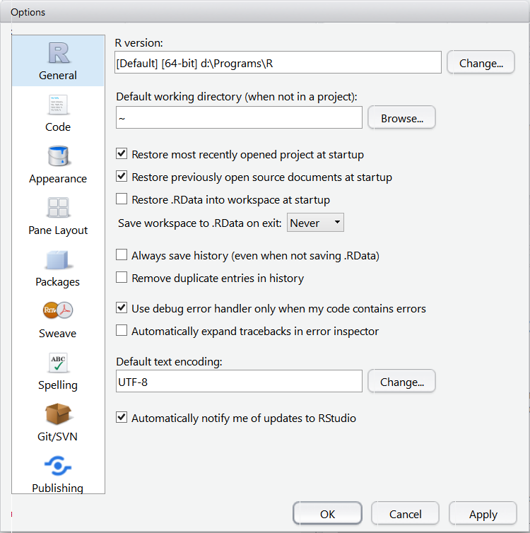

# Seven steps to solve an error in a problem set:

Here is some advice how to proceed if you get an error when solving your interactive problem set that you don't know how to solve. Please follow the seven steps in this order if you encounter an error that you cannot solve.

## 1. Check you solution with Ctrl+S & Ctrl+Alt+R

The whole idea of RTutor is to provide some help in automatically checking your solution. Save your .Rmd file by pressing Ctrl+S and then evaluate your code by pressing Ctrl+Alt+R (running all chunks.) This has the effect that the function `check.problem.set` at the beginning of your code is run, which tries to automatically check your solution.

## 2. Check out for a hint

Sometimes you have the option to type hint() to get a hint of how to solve the exercise.

## 3. Take a look at the list of common errors and solution below in Section 2 of this document.

Some errors will not be detected by RTutor or the error message is not really useful. Below is a list that should help you to identify and resolve some of those errors.


## 4. Make sure you have installed the newest version of RTutor (from github) and have downloaded the newest version of the .rps file. Clear Workspace and restart RStudio.

Sometimes an error is due to a bug in the problem set or in RTutor which may have already been fixed in the newest versions. Proceed as follows:

1. Install the newest version of RTutor from Github. See the installation instructions on [https://github.com/skranz/RTutor](https://github.com/skranz/RTutor).
2. Download the newest .rps file (from Moodle) in the folder with your problem set
3. Choose in RStudio the Menu command: Session -> Clear Workspace
4. Restart RStudio
5. Try out again checking the problem set

(Note: You may also need to remove the .RData file from your problem set folder. For a detailed description see Section 2.5 below.)

## 5. If your course has a discussion forum, check if somebody else had a similar error and whether there is an answer that solves your problem.

It is generally a good idea for course instructors to create such a discussion forum, e.g. on the Moodle site of the course.

## 6. If your course has a discussion forum, use it to post a question. Show the R output for the error and maybe a one or two lines of your code where the error occurs. (But *don't* upload your whole problem set.)

On the discussion forum you should get answers either by other students or by the teaching assistant or lecturer of the course. The nice thing is that other students who encounter similar problems can then also use these answers.

## 7. Only if points 1 to 6 don't help, send an email to your teaching assisstant (and possibily to your lecturer) with your .Rmd file and a description of your error.

# Frequently encountered errors and their solution

## 1. You destroyed the header or footer line of a code chunk

Do you get an error message looking similar to the following:

    > source('~/.active-rstudio-document', echo=TRUE)
    Error in source("~/.active-rstudio-document", echo = TRUE) : 
      ~/.active-rstudio-document:36:2: unexpected ')'
    35: 
    36: b)

It could then be that you have destroyed the header or footer line of a code chunk. Your problem sets have the format of R-Markdown files (.Rmd) which are simple text files that allow to mix formatted text with R code. Here is an example: 

    a) Compute in R 5*5
    ```{r }
    5*5
    ```
    b) Now store the value 10 in the variable x ...


A code chunk starts with a line like
```
    ```{r }      
```

and ends with a line
```
    ```
```

Never change those start and end lines!

Changing these lines can happen by accident, however. E.g. you may accidentally remove the footer line of the code chunk and get something like

    a) Compute in R 5*5
    ```{r }
    5*5
    
    b) Now store the value 10 in the variable x ...

If you then check your solution, you will get a cryptic error message as above. The best is to search for the code shown in the error message (here `b)`) and check whether you messed up a code chunk above.
Note that RStudio shows code chunks with a light-grey background while text has white background. This should help you to find messed up code chunks.

## 2. Problems reading csv files (Excel distorts csv files) 

If your problem set uses some data, e.g. in a csv file, always download the file directly from your browser (right click on the file)

Don't open the file in Excel and save afterwards. It is very likely that Excel changes the format of the csv file and that it cannot be correctly used afterwards in your problem set.

## 3. Packages cannot be installed for your brand new R version

If you have installed a brand new R version it can unfortunately sometimes happen that some R packages are not yet available for that newest R version. When you try to install them from CRAN you get an error message like:

```
    "packages ‘magrittr’, ‘Lahman’, ‘highflights’ are not available (for R version 3.1.0)"
```

I don't know a better solution than installing again a previous release of R instead of the newest version. Here is a website with earlier R releases for Windows:

http://cran.r-project.org/bin/windows/base/old/

## 4. zip.solution() does not work

The function `zip.solution` only works under Windows if you have installed some extra software manually. You can either install the software manually or generate the zip files manually.

#### Installing software to make zip.solution work

If zip.solution() doesn't work and you have made sure that your code is otherwise prepared (Path and Username set correctly, RTutor has checked your file [CTRL+ALT+R]), please try the following (assuming you have a Windows PC):

1. Install http://gnuwin32.sourceforge.net/packages/zip.htm

2. Check whether the WINDOWS-Path includes the directory of the zip.exe file. If it doesn't correct this.

  a) You can do this either directly (see: http://www.computerhope.com/issues/ch000549.htm) or

  b) Use a freeware Tool with a nicer handling (e.g. http://eveditor.com/ -> "Path")

[In theory it should suffice to install Rtools (http://cran.r-project.org/bin/windows/Rtools/), but this didn't do it for me]

If you do not have a Windows PC, but a Mac or a Unix System, you should have a built-in command line zip program. This means everything should work from the start. If it doesn't, please make an appointment with me and I will have a look into it.

#### Manually generate a zip file with your solution

Make sure that your code is otherwise prepared (Path and Username set correctly) and that RTutor has checked your file [CTRL+ALT+R]). The file name of your zip file shall have the structure:

solution_pssetname_by_username.zip

For example, for the first problem set and username = "Sebastian" it would be

solution_r_intro_by_Sebastian.zip

Please include the following three files in the zip file:

r_intro.rmd
r_intro.log
username_r_intro.ups

## 5. Strange errors of RTutor -- Remove file .Rdata from your problem set directory

We had the case of very cryptic RTutor errors that looked similar as follows when checking your solution:

```
error in eval(...): cannot find function check.assign
```
The error could be fixed by doing the following:

  1. Close RStudio
  2. Open with your file explorer your problem set directory
  3. Search for a file with name `.RData` and if it exists, delete it.
  
Background: 
When you close RStudio, you will typically asked a question, similar as follows: "Do you want to save your Workspace to C:/folder/.RData?". If you press yes, your current R objects in the memory will be stored in the .RData file and automatically be loaded, if you start RStudio by double clicking on a file in this folder. However, sometimes you want a fresh restart of RTutor and it can cause problems if you have reloaded a workspace that was saved, after you have already run RTutor. So you need to remove the .RData file.

Alternative solution: Change RStudio options not to load .RData files

Instead of manually deleting the .RData files, you can tell RStudio to never load (or save .RData files). For this go to the menu

Tools --> Global Options

Then disable the following option and press "Apply":
  
  - "Restore .RData into workspace on start up"

In addition, you can also set the option "Save workspace to .RData on exit" to "never", to avoid that the workspace is saved when you close RStudio.

See the screenshot for the desired option settings:


