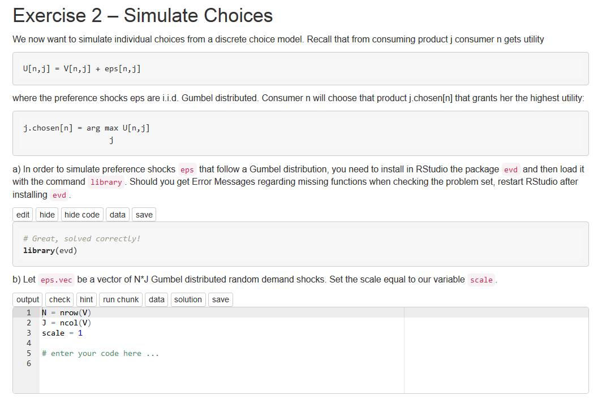
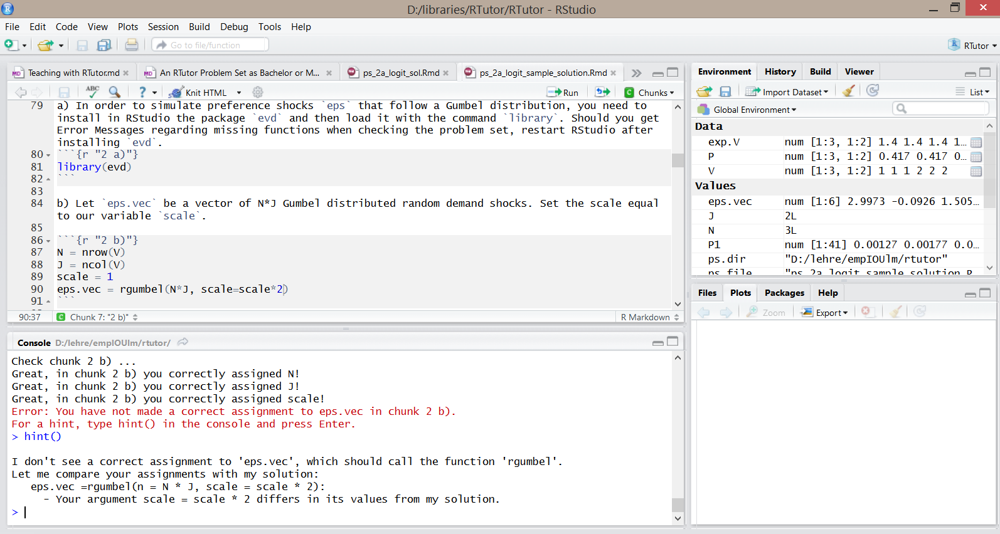

# The Basics

## Overview of RTutor

RTutor is an open source R package that allows to develop interactive R problem sets. While solving the problem set on th eown computer at home, a student can directly test her solution for each exercise part and can also get automatic hints when being stuck. Solutions can be submitted, e.g. via upload on Moodle or per Email and can then be automatically graded.

Problem sets can either be solved as RMarkdown  .rmd file directly in RStudio or in a browser based interface powered by Shiny. I have already used the RMarkdown based RTutor problem sets in my Master courses at Ulm University, with quite positive feedback. Furthermore, I have supervised several students who have created very nice  browser-based RTutor problem sets that allow to replicate the analyses of well published economic articles in an interactive fashion.

RTutor's Github page contains more documentation, examples and installation instructions:

[https://github.com/skranz/RTutor](https://github.com/skranz/RTutor)

This document wants to give some tips for using RTutor problem sets for teaching in a (University) course. 

## Generating interactive problem sets

There is an extra tutorial that describes in detail, how to generate a problem set:

https://Github.com/skranz/RTutor/blob/master/vignettes/Guide_for_Developing_Interactive_R_Problemsets.md

https://Github.com/skranz/RTutor/raw/master/vignettes/Guide_for_Developing_Interactive_R_Problemsets.pdf  (pdf)

Start by trying to run the simple example and then try to build your own exercises. The guide also briefly explains how to solve a problem set.

## Make sure that you call `create.ps` with the option `rps.has.sol=FALSE`

## Installation and Usage Guide for Students

It is a good idea to create for your course a short guide that explains students, how to install R, RStudio and all required packages, and how to download, solve and submit RTutor problem sets. 

Here is a template (in markdown format) of such a guide, which you can adapt for your course:

(You can edit the guide in RStudio).

... to be done ...

# Further Topics

## Choice of Interface: Webbrowser or RMarkdown file in RStudio? 

RTutor problem sets can be solved in two different manners. 

  1. One can solve problem sets in a nice looking HTML interface that runs locally in the web browser.
  
  2. Alternatively, one can solve problem sets as a RMarkdown file directly in RStudio.

Here are screenshots of the two interfaces:

  (Figure 1: Screenshot of browser interface)

  (Figure 2: Screenshot of RStudio & RMarkdown interface)  
  
While the interfaces look quite different, they have very similar functionality. In particular,
both interfaces allow the student to automatically assess the solution and to get interactive hints.

### Choosing an interface for your course

In principle, it is possible to solve any given problem set in both interfaces. Yet, I think it is a good idea to give for any course a strong recommendation which interface students should use and to design your problem sets with that particular interface in mind.

A rough recommendation for interfaces is the following:

  - For courses at an introductionary level, courses with many students, for students with less experience in R and programming, the browser interface seems more suitable.
  
  - For advanced, smaller courses, with students that are more computer sawvy, the RStudio with RMarkdown interface may be superior. 

The browser interface definitely looks nicer and you can even render nice Latex formulas. Getting started is easier and there are fewer opportunities for students to create errors. However, the interface is a bit artifical, since it is only used for RTutor.

The advantage of RStudio & Markdown problem sets, is that students work in a common R environment and can use all the features of a full fledged IDE (RStudio). They also get aquainted with the very useful Markdown format, that allows to interweave explanatory text, Latex math, and R code chunks. I also find this interface more transparent, since students work on a plain text format. However, it is a bit harder to get started in the markdown format and some students will in the beginning probably mess up the structure of the problem set and get strange error messages.

For my Master courses in Ulm, I have chosen the RStudio & Markdown interface, but there are also many arguments in favor of the browser interface.

## Distribute your problem sets

If you create a problem set, let's call it `myps`, with `create.ps(ps.name="myps",...)` several files are automatically generated. The file ending with `myps.rps` is a binary R data file that contains all information to run a problem set in the browser environment. If you pick the RStudio & RMarkdown interface, students need in addition to the `myps.rps` file, the `myps.rmd` file. It contains an empty problem set, which can be opened and edited by the students in RStudio.

I distribute my problem sets in a course by putting the required files into a ZIP file, which I put on the Moodle site of the course. I then ask the students to download the ZIP file and extract them in a working directory for their problem sets.

I think it is best to always ZIP the files (even if you only have an `.rps` file), since this avoids problems if Windows or Moodle for whatever reason decides to change a file extension of `.rps` or `.rmd` files.

Of course, your ZIP file can also contain data files that are used in the problem set.

## Collect solved problem sets from students

### ZIP file of solution

When a student with username `Max` works on a problem `myps`, several files are generated. The following will be used to automatically assess a student's solution:

  - `max_myps.ups`: summary statistics of which test's the student's solution has passed
  - `myps.log`: a log file of the student's solution progress
  - `myps.rmd`: the student's solution as a markdown file (this is the file the student directly edits in the RStudio based interface)
  - `max_myps.sav` (browser interface only) a binary R file that contains the student's solution in the browser interface.
  
When having finished the problem (or the deadline is approaching), the student should create a ZIP file of these files and upload them to your Moodle assignment (or send them to your TA via Email.) RTutor has tools that can create the ZIP file automatically. They are explained in the Guide for the Students.

### Moodle assignment

In the Moodle site of your course, you can create an `Assignment` for the problem set. You can specify a due date and students can upload their ZIP file for this assignment.

(See https://docs.moodle.org/26/en/Assignment_settings)

## Grading problem sets

## Share of tests passed

If a student types the command `stats()`, she sees how many percent of each exercise, she has solved. This share is simply the number of automatic tests that have been passed divided by the total number of tests. This share of tests passed will be the basis for an automated grading. It is not possible to specify different weights to different parts of the exercise.

### How should problem sets matter for the final grade?

You must decide yourself, whether and how you use these shares of passed tests influence the final grade. It could make up a fraction of the final grade or you may give some bonus poiunts. You could also require a minum share of passed tests to be admitted to the exam. 

If the solutions shall make up a part of the final grade of the course, I would not give them any large weight, however. For example, just let all problem sets together account for just 10% of the final grade. The reason is that with enough effort there will always be ways to cheat in a manner that you cannot detect. Naive cheating can in principle be detected if you ask students to also submit the log files (which is the default option). But still, you can always trick the system.

Furthermore, I find it nicer to provide sufficient hints such that also average students will be able to solve all problem sets. So any grading component should mainly be used to motivate students to solve the problem set instead of trying to effectively screen high-skilled from low-skilled students.

Related to this issue, I would not reduce points if students use hints. (This cannot be effectively controlled, anyway.)

## Motivating students to solve problem sets

### Grade awareness 

"This is relevant for your grades." is an evergreen classic to motivate students.

Thus, to motivate students to solve the problem sets, I would definitely ask them to submit the solution, grade them, and make the results to a small degree relevant for the final grade / final exam. (See the details above for how to implement this in an automotatized fashion.)

### Awards

In addition, RTutor problem sets can have a small gamification element, by giving students "Awards" after having finished some exercises. (How to create awards is explained in the tutorial for creating problem sets). Awards are extensively used in video games, where you get awards / achievements or trophies for all sorts of stuff, without these awards really being relevant for the continuation game. See e.g.

[http://en.wikipedia.org/wiki/Achievement_%28video_gaming%29](http://en.wikipedia.org/wiki/Achievement_%28video_gaming%29)

I would not make awards towards a grade. Still, if they work in video games, why should they not work in problem sets? And hey, even the world's probably biggest data collecting organisation (lat. Octopus Informationis) has used awards to teach it analysists... so how could this be a bad thing?

[http://qz.com/114277/to-learn-spying-software-nsa-analysts-unlock-achievements-to-win-skilz/](http://qz.com/114277/to-learn-spying-software-nsa-analysts-unlock-achievements-to-win-skilz/)

### Design of the problem set

Probably the most important factor for motivation is that you design your problem sets in an interesting fashion and match student's learning curve in an approbriate fashion.

How to do it... I guess you have to figure out yourself.

## Forum / News Group / Mailing list for the Course

I always created a Moodle Forum for my courses, where student's should ask their questions if they get stuck with a problem set or some strange error occurs. Sometimes other students give direct advice, otherwise my teaching assisstant or me gives an answer. The main advantage over individual questions in office hours or emails, is that with similar problems    

